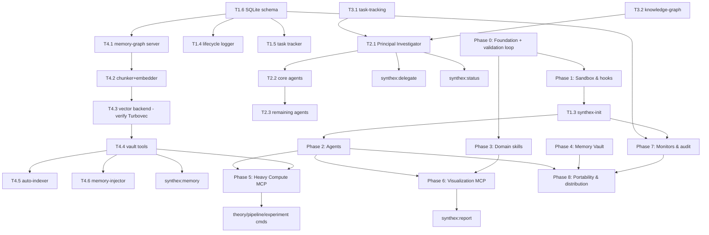

# Synthex — Build Plan

Micro-task breakdown and dependency graph for building the Synthex Claude Code plugin.
Source specs: `../draft_uno.md` (PRD v2, the *what*) and `../Build_guide.md` (the *how*).
Ground every harness assumption against `../reference_materials/` before coding.

**Legend:** `☐` todo · `◐` in progress · `☑` done · `⚠` blocked/needs verification

---

## Guiding rules (carried from the PRD)

1. **Zero-write sandbox.** Agents read only `user-input/`, `knowledgebase/`, `agent-output/`; write only `agent-output/`. Enforced by `sandbox-gate.sh` (`PreToolUse`, exit 2 to block).
2. **No trace is ever lost.** Every subagent lifecycle event and task decision is logged to SQLite (`logs/`), and every artifact is indexed into the Memory Vault.
3. **Verify before you build on a claim.** The PRD names forward-looking tech (e.g. "Turbovec", "ICLR 2026"). Treat these as unverified until T4.3 confirms them; a known-available store is the default.

---

## Corrections already applied in the skeleton (vs. Build_guide.md)

These were reconciled against `reference_materials/` while scaffolding — don't re-introduce the originals:

| Build_guide.md said | Reality (per docs) | Where |
| :-- | :-- | :-- |
| Monitors via `experimental.monitors` in `plugin.json`, one `monitor.json` per monitor | Monitors live in `monitors/monitors.json` as a **JSON array** | `monitors/monitors.json` |
| MCP tools appear as `mcp__synthex_<server>__<tool>` | Plugin-bundled servers are `mcp__plugin_synthex_<server>__<tool>` | note in README |
| `UserPromptSubmit` / `TaskCreated` / `TaskCompleted` with `"matcher":"*"` | Those events take **no matcher** — omitted | `hooks/hooks.json` |
| Agent frontmatter with `effort`, `maxTurns`, `disallowedTools`, `memory`, `skills` | Not confirmed valid — skeleton uses only `name`/`description`/`model` until T0.6 verifies | `agents/*.md` |
| Vault default `turbovec` | Unverified package → default `chroma` until T4.3 | `plugin.json` userConfig |

---

## Phase 0 — Foundation & validation loop

- ☐ **T0.1** Plugin root + `.claude-plugin/` created *(done in skeleton)*
- ☐ **T0.2** `plugin.json` manifest *(skeleton present; finalize author/repo/homepage)*
- ☐ **T0.3** `README.md`, `.gitignore`, `LICENSE`
- ☐ **T0.4** `git init`, first commit
- ☐ **T0.5** Green validation loop: `claude plugin validate` passes and `claude --plugin-dir ./synthex-plugin` loads with no errors. **This is the gate every later phase must keep green.**
- ☐ **T0.6** ⚠ Verify subagent frontmatter fields against `reference_materials/Custom_subagents.md`; add tool restrictions to agents once confirmed.

## Phase 1 — Sandbox & lifecycle hooks (safety core)

- ☐ **T1.1** `hooks/hooks.json` wiring *(skeleton present)*
- ☐ **T1.2** `sandbox-gate.sh` — path enforcement *(minimal logic present; add `permissive` mode + Bash-write detection via `git status`)*
- ☐ **T1.3** `/synthex:synthex-init` — scaffold the **runtime** sandbox in the user's project (`user-input/`, `agent-output/`, `knowledgebase/`, `logs/{vectors,archives}`), create SQLite DBs, boot the Archivist monitor
- ☐ **T1.6** SQLite schema init (`intents.db`, `state_ledger.db`, `tasks`) — shared by T1.4/T1.5/T4.1
- ☐ **T1.4** `agent-lifecycle-logger.sh` → `state_ledger.db`
- ☐ **T1.5** `task-tracker.sh` → `intents.db`
- ☐ **T1.7** Hook tests: pipe sample JSON to each script, assert exit codes (block on out-of-sandbox write, allow inside)

## Phase 2 — Agents (orchestration)

- ☐ **T2.1** `principal-investigator` — decomposition, spawning, verification, roadmap
- ☐ **T2.2** Core division agents: `methodologist`, `data-engineer`, `software-engineer`, `documentation-engineer`
- ☐ **T2.3** Remaining agents: `research-scientist`, `algorithm-engineer`, `research-assistant`, `automation-engineer`, `frontend-engineer`
- ☐ **T2.4** `/synthex:delegate` (PI intake)
- ☐ **T2.5** `/synthex:status` (reads `tasks` table)

## Phase 3 — Domain skills

- ☐ **T3.1** `task-tracking` + **T3.2** `knowledge-graph` *(consumed by the PI — do these first)*
- ☐ **T3.3** `data-lineage` · **T3.4** `experiment-design`
- ☐ **T3.5** `frontend-dev` · **T3.6** `3d-modeling` · **T3.7** `presentation` · **T3.8** `whitepaper` · **T3.9** `prototyping`

## Phase 4 — MCP: Memory & Graph (the Memory Vault)

- ☐ **T4.1** `memory-graph/server.py` — MCP stdio server; SQLite tables (depends T1.6)
- ☐ **T4.2** Chunker (≤512 tok, 20% overlap) + local embedder (`all-MiniLM-L6-v2`, 384-dim)
- ☐ **T4.3** ⚠ Vector-backend abstraction. **Verify Turbovec is a real, installable package.** If not, ship `chroma`/`faiss`/`lancedb` behind the same interface (PRD §7.1 compares them).
- ☐ **T4.4** Tools: `vector_retrieve`, `kg_add`, `kg_query`, `lineage_trace`
- ☐ **T4.5** `auto-indexer.sh` → index on write (depends T4.4)
- ☐ **T4.6** `memory-injector.sh` → inject top-k on prompt (depends T4.4; keep <30s hook budget)
- ☐ **T4.7** `/synthex:memory` (manual query)

## Phase 5 — MCP: Heavy Compute

- ☐ **T5.1** `heavy-compute/Dockerfile` (PyTorch/JAX/SymPy)
- ☐ **T5.2** `server.py` tools: `docker_run`, `sympy_solve`, `profile_script`, `etl_validate`
- ☐ **T5.3** Command skills: `/synthex:theory`, `/synthex:pipeline`, `/synthex:experiment`

## Phase 6 — MCP: Visualization

- ☐ **T6.1** `visualization/server.js` tools: `threejs_scaffold`, `react_component`, `preview_ui`
- ☐ **T6.2** `/synthex:report` (ppt/html/pdf) — uses `presentation`/`whitepaper`/`3d-modeling`/`frontend-dev`

## Phase 7 — Monitors & audit

- ☐ **T7.1** `monitors/monitors.json` *(skeleton present)*
- ☐ **T7.2** `audit-archivist/archivist.py` — snapshot loop → `state_ledger.db`, status line per tick
- ☐ **T7.3** `/synthex:audit` — compile logs into chronological Markdown

## Phase 8 — Portability & distribution

- ☐ **T8.1** ⚠ Verify the IR/adapter tooling named in PRD §11 (`x927`, `Tome`) actually exists; otherwise document the manual per-harness manifest path
- ☐ **T8.2** `marketplace.json` for distribution
- ☐ **T8.3** CI: `claude plugin validate` + package `.zip` artifact
- ☐ **T8.4** End-user docs in `docs/`

---

## Dependency graph



### ASCII fallback

```
Phase 0 (foundation + green validation loop)
  |-> Phase 1 (sandbox & hooks)
  |      T1.6 schema --+-> T1.4 logger
  |                    +-> T1.5 task-tracker
  |                    +-> T4.1 memory-graph server
  |      T1.3 synthex-init --> Phase 2, Phase 7
  |-> Phase 3 (domain skills)
  |      T3.1 task-tracking --+
  |      T3.2 knowledge-graph -+--> T2.1 PI --> T2.2 core --> T2.3 rest
  +-> Phase 4 (Memory Vault)
         T4.1 --> T4.2 --> T4.3 (verify) --> T4.4 --+-> T4.5 auto-index
                                                    +-> T4.6 inject
                                                    +-> synthex:memory

Phase 2 + Phase 4 --> Phase 5 (Heavy Compute) --> theory/pipeline/experiment
Phase 2 + Phase 3 --> Phase 6 (Visualization) --> synthex:report
Phase 1.6 + 1.3   --> Phase 7 (Monitors/audit) --> synthex:audit
Phase 2 + 4 + 7   --> Phase 8 (Portability/distribution)
```

## Critical path

`T0.5 (green load) → T1.6 (schema) → T4.1 → T4.2 → T4.3 (⚠ Turbovec) → T4.4 (vault tools) → T4.6 (injection) → T8`.
The Memory Vault is the longest pole and carries the biggest unknown (T4.3); de-risk it early with a spike before committing the rest of Phase 4.

## First sprint (recommended)

T0.3 → T0.4 → T0.5 → T0.6 → T1.6 → T1.2 → T1.7. This gets a **loadable, sandbox-safe, validated** plugin skeleton committed before any agent or MCP logic — a green foundation to iterate on.
