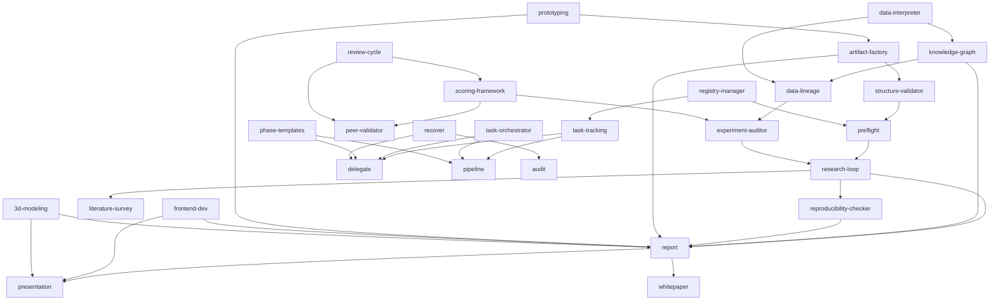

# Synthex Skill Dependencies

> Auto-generated from `related_skills` frontmatter fields. Regenerate after any skill merge or addition.

## Key

| Edge | Meaning |
|------|---------|
| A --> B | Skill A's output is typically consumed by or feeds into skill B |
